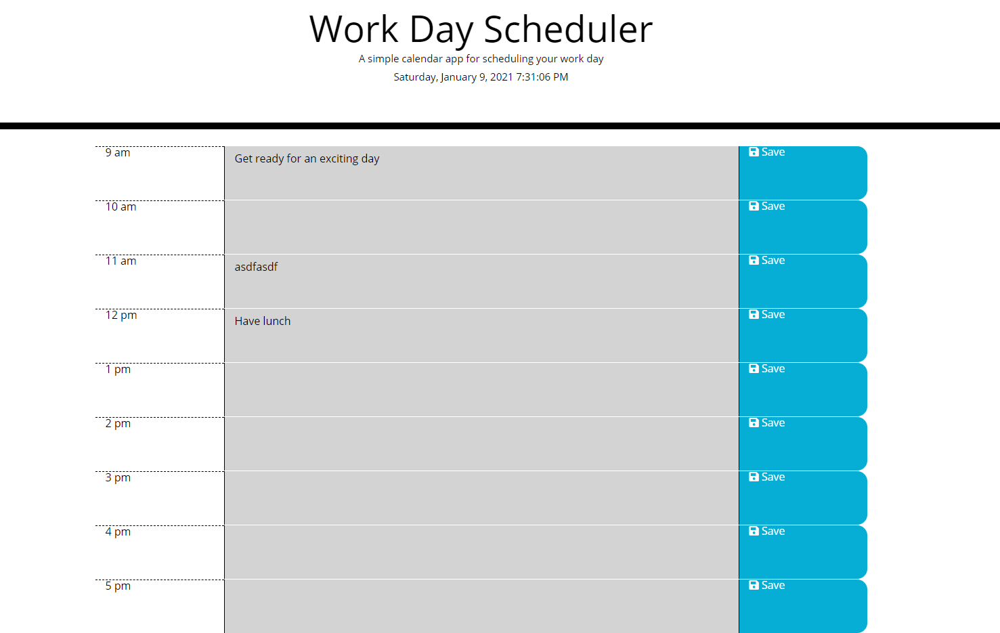

# day-planner

## About this page

This is a simple day planner using jQuery and Day.js to dynamically create hourly text fields for the user. Activities can be saved to each field and will reload from local storage. HTML and CSS were used with only the minor alterations. Day.js was chosen to handle as it has very similar syntax to Moment.js, but has continued developer support.

site is deployed at: [day-planner](http://www.jacobaf.com/day-planer/)

## Features

- This daily planner is designed to create a schedule
- Upon opening the planner the current date and time are displayed at the top
- The displayed time is updated in realtime
- Below are time blocks rendered for the standard business hours of 9am to 5pm
- The time blocks are color coded in response to the hour of the day indicating past, present and future.
- Each time block has a text area where an event can be entered.
  *In each row is a save button that will store the entered event to local storage.
  *If the page is refreshed, any saved events will persist.

## Potential Improvements

- variable business hours
- changeable time blocks for activities of different length
- ability to move between different days
- memory of past activites that could be reassigned on new days

## Contents

- index.html
- README.md
- LICENSE
- (assets)
  - script.js
  - style.css
  - (screenshots)

## Usage

#### Welcome Screen

## Credits

A thank you forever for reference material at [MDN](https://developer.mozilla.org/en-US/), [w3 Schools](http://w3schools.com), and [Stack Overflow](https://stackoverflow.com/).

## License

This website is licensed under the MIT license, copyright 2021
